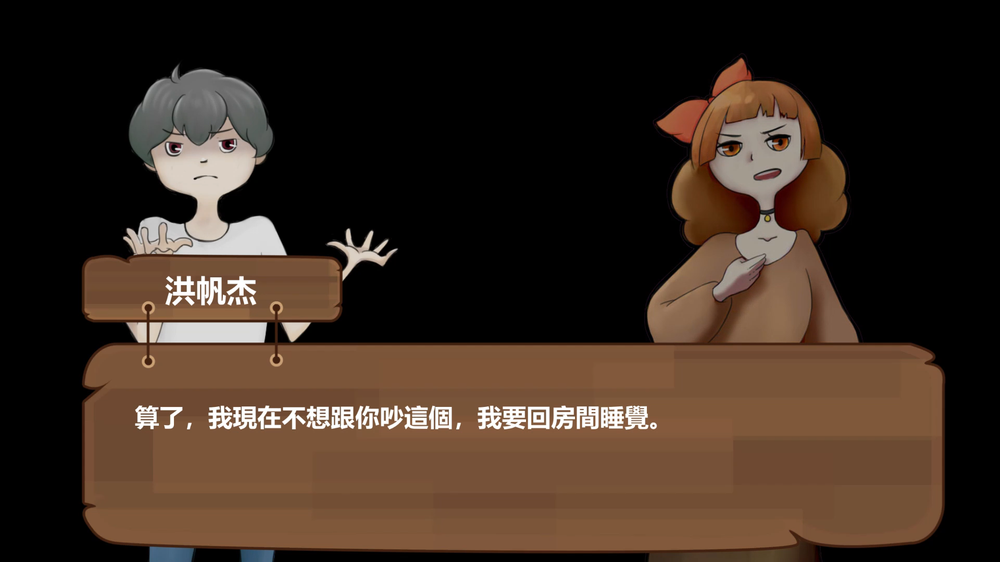
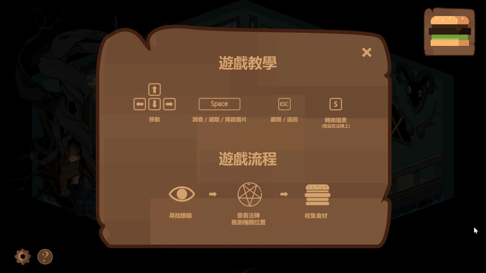
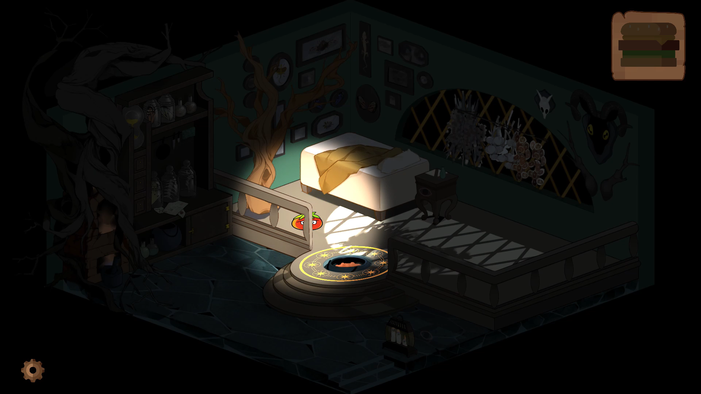
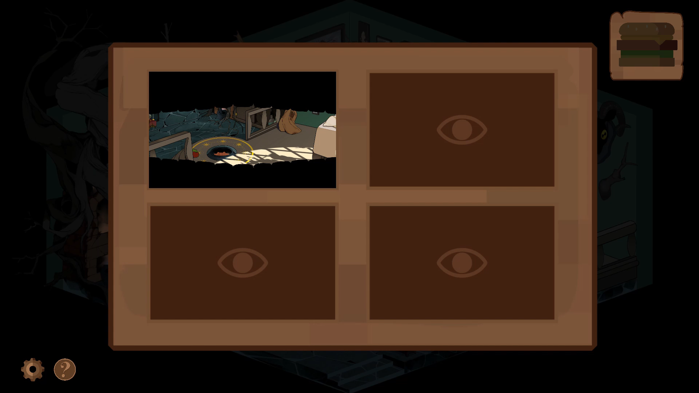

<h1 style="font-size: 28px;">roomMATO - 2D解謎遊戲</h1>

roomMATO是由<strong>匿名工作室</strong>開發的解謎遊戲，主打「從不同觀察角度切換來解謎」的創新機制。遊戲中，玩家將在立方體房間中，切換兩個對角觀察視角來獲取線索、發現道具與觸發機關，藉此推進遊戲進度。整體遊戲強調空間理解與觀察思維的轉換。

<h2>執行平台</h2>

本遊戲提供PC運行，適用於 Windows 系統。

<h2 style="font-size: 20px;">系統畫面展示</h2>

<h3 style="font-size: 16px;">系統畫面</h3>
<table>
  <tr>
    <td></td>
    <td></td>
  </tr>
  <tr>
    <td></td>
    <td></td>
  </tr>
</table>

<h3 style="font-size: 16px;">展示影片</h3>

點擊圖片觀看實際展示影片

<h2>專案用途</h2>

本專案為 Unity 製作的2D單人解謎遊戲作品，展示以下遊戲設計與開發能力：

<ul>
  <li>視角切換系統設計與實作</li>
  <li>多房間場景與互動邏輯規劃</li>
  <li>物件狀態轉換與提示邏輯</li>
  <li>整合 <strong>Fungus</strong> 套件進行對話與事件流程控制</li>
  <li>敘事與視覺導引的整合</li>
</ul>

<h2>操作方式</h2>
<ol>
  <li>玩家可在場景中切換觀察視角</li>
  <li>視角為固定的房間對角觀察點，切換後能從不同角度看到角色與場景中的線索</li>
  <li>透過觀察視角差異，發現道具、觸發機關或解開謎題，進而推進關卡</li>
</ol>

<h2>開發工具</h2>
<ul>
  <li>Unity 2019.4.3f1</li>
  <li>C# / Unity API</li>
  <li><strong>Fungus</strong>（視覺化流程與對話控制套件）</li>
</ul>

<h2>專案結構說明</h2>
<ul>
  <li><strong>關卡流程管理：</strong> 
    控制整體流程切換、場景轉換、角色狀態切換與提示機制控制。 
    代表腳本：<code>jumpout.cs</code>
  </li>

  <li><strong>提示與介面互動：</strong> 
    控制提示文字、教學圖示、魔法特效顯示與使用者介面。 
    代表腳本：<code>Instructions.cs</code>、<code>change_sprite.cs</code>
  </li>

  <li><strong>角色控制與動畫：</strong> 
    處理角色移動、方向鍵輸入、動畫切換與跳躍音效。 
    代表腳本：<code>player_walk_2.cs</code>、<code>animation.cs</code>、<code>MouseDetector.cs</code>
  </li>

  <li><strong>關卡互動邏輯：</strong> 
    各房間對應的互動事件與任務流程整合，包括物品取得、提示觸發與動畫控制。 
    代表腳本：<code>bread.cs</code>、<code>cheese.cs</code>、<code>meet.cs</code>、<code>vagetable.cs</code>
  </li>
</ul>

<h2>⚠️ 注意事項</h2>
<ul>
  <li>若使用 Fungus 對話時有中文亂碼，請確認字體支援或自行更換中文字型</li>
</ul>

<h2>製作團隊</h2>

<strong>匿名工作室（大學畢業製作團隊）</strong>

<ul>
  <li><strong>我：</strong>場景建置、角色動畫、介面互動、遊戲提示及介紹流程開發</li>
</ul>

<h2 style="font-size: 20px;">📄 版權聲明</h2>

本專案由 <strong>匿名工作室</strong> 團隊製作，僅作為畢業專題與個人作品集展示用途。
  

未經本團隊書面授權，禁止轉載、使用、改作或進行任何形式之商業用途。

© 2025 匿名工作室. All Rights Reserved.

